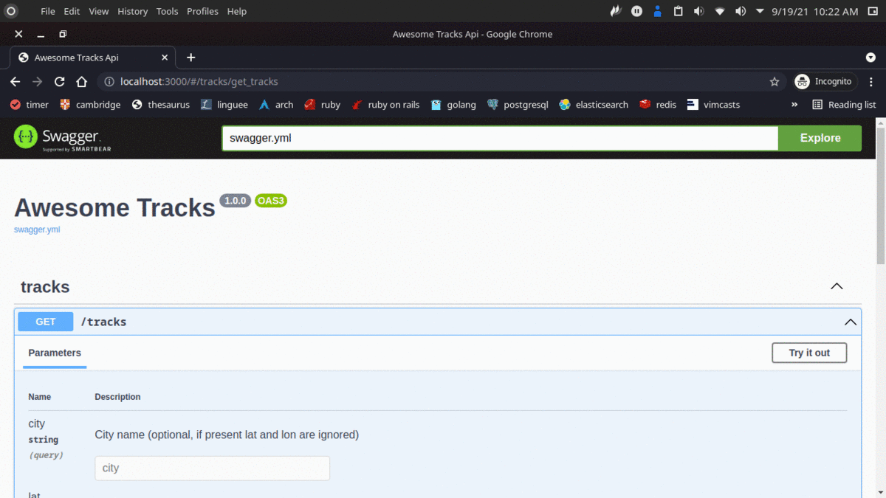

<h1 align="center">
  Awesome Tracks
</h1>

<p align="center">
  <a href="#rocket-project">Project</a>&nbsp;&nbsp;&nbsp;|&nbsp;&nbsp;&nbsp;
  <a href="#computer-techs">Techs</a>&nbsp;&nbsp;&nbsp;|&nbsp;&nbsp;&nbsp;
  <a href="#thinking-how-to-use">How to use</a>&nbsp;&nbsp;&nbsp;|&nbsp;&nbsp;&nbsp;
  <a href="#memo-license">License</a>
</p>

## :rocket: Project

**Architecture**

<p align="center">
  
</p>

**Preview**

<p align="center">
  
</p>

## :computer: Techs

- gRPC
- Ruby
- RSpec
- Sinatra

## :thinking: How to use

**Running locally**

```sh
git clone https://github.com/flaviogf/awesome_tracks_e6bdfb76.git

cd awesome_tracks_e6bdfb76

# set the env var SPOTIFY_CLIENT_ID inside of docker-compose.yml

# set the env var SPOTIFY_CLIENT_SECRET inside of docker-compose.yml

docker-compose up --build -d

# It's running at http://localhost:3000
```

**If you want to update generated codes run the commands bellow inside the containers**

```sh
# awesome_tracks_api generated code

grpc_tools_ruby_protoc -I ./weather_service/protos/ --ruby_out=./awesome_tracks_api/lib/awesome_tracks_api/repositories/ --grpc_out=./awesome_tracks_api/lib/awesome_tracks_api/repositories/ ./weather_service/protos/weather_service.proto
grpc_tools_ruby_protoc -I ./tracks_service/protos/ --ruby_out=./awesome_tracks_api/lib/awesome_tracks_api/repositories/ --grpc_out=./awesome_tracks_api/lib/awesome_tracks_api/repositories/ ./tracks_service/protos/tracks_service.proto

# tracks_service generated code

grpc_tools_ruby_protoc -I ./tracks_service/protos/ --ruby_out=./tracks_service/bin/ --grpc_out=./tracks_service/bin/ ./tracks_service/protos/tracks_service.proto

# weather_service generated code

grpc_tools_ruby_protoc -I ./weather_service/protos/ --ruby_out=./weather_service/bin/ --grpc_out=./weather_service/bin/ ./weather_service/protos/weather_service.proto
```

## :memo: License

This project contains the MIT license. See the file [LICENSE](LICENSE).
